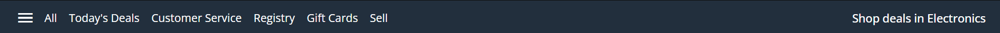

# Amazon Clone


## Table of Contents

- [Introduction](#introduction)
- [Live Demo](#live-demo)
- [Coding Explanation](#coding-explanation)
    - [Header](#header)
    - [Offer Banner](#offer-banner)
    - [Products](#products)
    - [Footer](#footer)

## Introduction

The **Amazon Clone** is a frontend-only web application that replicates the basic structure and design of Amazon's e-commerce website. This project is built purely using HTML and CSS, and it showcases various CSS techniques such as flexbox, grid layouts, and CSS transitions.

## Live Demo

You can view the live demo of the project here: [Amazon Clone Live Demo](https://priyanka-sharma-paul.github.io/Geekster-Html/Weekly-Test-5/)

## Coding Explanation

We will explain the each part of HTML (UI) explaining which part is created using which HTML tag and what CSS properties you used for different parts of UI with screenshot.

### Header

In header there is two parts.

#### Top Part
At the top of the navbar we have Amazon logo, delivery location, search bar, sign in option, return option and cart


- Html
```html
<nav class="navbar">
    <div class="nav-logo">
    <a href="#"></a>
    </div>
    <div class="address">
    <a href="#" class="deliver">Deliver</a>
    <div class="map-icon">
        <span class="material-symbols-outlined">location_on</span>
        <a href="#" class="location">India</a>
    </div>
    </div>

    <div class="nav-search">
    <select class="select-search">
        <option>All</option>
        <option>All Categories</option>
        <option>Amazon Devices</option>
    </select>
    <input type="text" placeholder="Search Amazon" class="search-input">
    <div class="search-icon">
        <span class="material-symbols-outlined">search</span>
    </div>
    </div>

    <div class="sign-in">
    <a href="#"> <p>Hello, sign in</p>
    <span>Account &amp; Lists</span></a>
    </div>

    <div class="returns">
    <a href="#"><p>Returns</p>
        <span>&amp; Orders</span></a>
    </div>

    <div class="cart">
    <a href="#">
        <span class="material-symbols-outlined cart-icon">shopping_cart</span>
        </a>
        <p>Cart</p>
    </div>
</nav>
```

- CSS
```css
.navbar {
  height: 60px;
  display: flex;
  align-items: center;
  justify-content: space-evenly;
  cursor: pointer;
  color: #fff;
  max-width: 1280px;
  margin: 0 auto;
}

.nav-logo img {
  margin-top: 10px;
  width: 128px;
}

.address .deliver {
  margin-left: 20px;
  font-size: 0.75rem;
  color: #ccc;
}

.address .map-icon {
  display: flex;
  align-items: center;
}


.nav-search {
  display: flex;
  justify-content: space-evenly;
  max-width: 620px;
  width: 100%;
  height: 40px;
  border-radius: 4px;
}

.select-search {
  background: #f3f3f3;
  width: 50px;
  text-align: center;
  border-top-left-radius: 4px;
  border-bottom-left-radius: 4px;
  border: none;
}

.search-input {
  max-width: 600px;
  width: 100%;
  font-size: 1rem;
  border: none;
  outline: none;
  padding-left: 10px;
}

.search-icon {
  max-width: 45px;
  width: 100%;
  display: flex;
  justify-content: center;
  align-items: center;
  font-size: 1.2rem;
  background: #febd68;
  color: #000;
  cursor: pointer;
  border-top-right-radius: 4px;
  border-bottom-right-radius: 4px;
}

.sign-in p,
.returns p {
  font-size: 0.75rem;
}

.sign-in,
.returns span {
  font-size: 0.875rem;
  font-weight: 600;
}

.cart {
  display: flex;
}

.cart .cart-icon {
  font-size: 2.5rem
}

.cart p {
  margin-top: 20px;
  font-weight: 500;
}

```

- Explanation of HTML and CSS

    1. Logo Section (.nav-logo):
        - HTML: Contains an image wrapped in a link.
        - CSS: Sets margin and width for the logo.

    2. Delivery Location Section (.address):
        - HTML: Contains a link for delivery and a div with an icon and a location link.
        - CSS: Styles the delivery link and aligns items using flexbox.

    3. Search Bar Section (.nav-search):
        - HTML: Contains a select dropdown, input for text, and a div for the search icon.
        - CSS: Uses flexbox for layout, sets background color, width, font size, padding, and border-radius for a rounded appearance.

    4. Sign In Section (.sign-in):
        - HTML: Contains a link with a greeting and account info.
        - CSS: Sets font size and weight for text.

    5. Returns Section (.returns):
        - HTML: Contains a link with returns and orders info.
        - CSS: Similar styling to the sign-in section for font size and weight.

    6. Cart Section (.cart):
        - HTML: Contains a link with a cart icon and text.
        - CSS: Uses flexbox for layout, sets font size for the icon, and margin for text alignment.

#### Bottom Part
At the bottom part we have links.



- Html
```html
<div class="banner">
    <div class="banner-content">
    <div class="panel">
        <span class="material-symbols-outlined">menu</span>
        <a href="#">All</a>
    </div>

    <ul class="links">
        <li><a href="#">Today's Deals</a></li>
        <li><a href="#">Customer Service</a></li>
        <li><a href="#">Registry</a></li>
        <li><a href="#">Gift Cards</a></li>
        <li><a href="#">Sell</a></li>
    </ul>
    <div class="deals">
        <a href="#">Shop deals in Electronics</a>
    </div>
    </div>
</div>
```
- CSS
```css
.banner {
  padding: 10px 20px;
  background: #222f3d;
  color: #fff;
  font-size: 0.875rem;
}

.banner-content {
  margin: 0 auto;
  max-width: 1280px;
  display: flex;
  align-items: center;
  justify-content: space-between;
}

.panel {
  max-width: 1280px;
  display: flex;
  align-items: center;
  gap: 5px;
  cursor: pointer;
}

.panel span {
  margin-right: 7px;
}

.links {
  display: flex;
  align-items: center;
  list-style: none;
  gap: 15px;
  flex-grow: 1;
  margin-left: 15px;
}

.links a {
  padding: 10px 0;
}

.deals a {
  font-size: 0.9rem;
  font-weight: 500;
  white-space: nowrap;
}
```

- Explanation of HTML and CSS

    1. Banner Container (.banner):
        - HTML: This is the outer container for the banner.
        - CSS: Adds padding, sets background color to a dark shade (#222f3d), sets text color to white, and sets the font size.
    
    2. Banner Content Container (.banner-content):
        - HTML: Contains the panel, navigation links, and deals section.
        - CSS: Centers the content horizontally with margin: 0 auto, sets a maximum width, uses flexbox for layout, centers items vertically, and distributes space between items.

    3. Panel Section (.panel):
        - HTML: Contains a menu icon and a link labeled "All".
        - CSS: Uses flexbox for layout, centers items vertically, adds space between the icon and the link, and changes the cursor to pointer on hover. Adds a margin to the icon.

    4. Navigation Links (.links):
        - HTML: Contains an unordered list (`<ul>`) with list items (`<li>`) and links (`<a>`).
        - CSS: Uses flexbox for layout, centers items vertically, removes default list styling, adds space between links, allows links to grow and take available space, and adds left margin. Adds vertical padding to the links.

    5. Deals Section (.deals):
        - HTML: Contains a link to shop deals in electronics.
        - CSS: Sets font size, font weight, and prevents the text from wrapping.

## Offer Banner

Here we have a banner for prime day offer


- Html
```html
<section class="hero-section"></section>
```

- CSS
```css
.hero-section {
  height: 400px;
  background-image: url("offer.jpg");
  background-position: center;
  background-size: cover;
}
```

- Explanation of HTML and CSS
    - HTML: The `<section>` element with the class hero-section serves as a container for the hero section.
    - CSS:  Sets the height of the hero section and the background image to offer.jpg. Centers the background image within the section. Scales the image to cover the entire section, maintaining its aspect ratio and ensuring no empty space is visible.

## Products

Here we have list of products highlighted


- Html
```html
<section class="shop-section">
    <div class="shop-images">
        <div class="shop-link">
        <h3>Shop Laptops &amp; Tables</h3>
        
        <a href="#">Shop now</a>
        </div>
        <div class="shop-link">
        <h3>Shop Smartwatches</h3>
        
        <a href="#">Shop now</a>
        </div>
        <div class="shop-link">
        <h3>Create with Strip Lights</h3>
        
        <a href="#">Shop now</a>
        </div>
        <div class="shop-link">
        <h3>Home Refresh Ideas</h3>
        
        <a href="#">Shop now</a>
        </div>
    </div>
</section>
```

- CSS
```css
.shop-section {
  display: flex;
  align-items: center;
  flex-direction: column;
  background-color: #f3f3f3;
  padding: 50px 0;
}

.shop-images {
  display: grid;
  grid-template-columns: repeat(auto-fit, minmax(250px, 1fr));
  gap: 40px;
  max-width: 1280px;
  width: 100%;
  overflow: hidden;
}

.shop-link {
  background-color: #fff;
  padding: 30px;
  display: flex;
  cursor: pointer;
  flex-direction: column;
  white-space: nowrap;
  transform: scale(1);
  transition: transform 0.7s ease-in-out;
}

.shop-link:hover{
  transform: scale(1.1);
}


.shop-link img {
  width: 100%;
  height: 280px;
  object-fit: cover;
  margin-bottom: 10px;
}

.shop-link h3 {
  margin-bottom: 10px;
}

.shop-link a {
  display: inline-block;
  margin-top: 10px;
  font-size: 0.9rem;
  color: blue;
  font-weight: 500;
  transition: color 0.3s ease;
}

.shop-link:hover a {
  color: #c7511f;
  text-decoration: underline;
}
```

- Explanation of HTML and CSS
    1. Shop Section Container (.shop-section)
        - HTML: This is the outer container for the shop section.
        - CSS:
            - Uses display: flex to apply flexbox layout.
            - Aligns items vertically with align-items: center.
            - Stacks items vertically using flex-direction: column.
            - Sets a light gray background with background-color: #f3f3f3.
            - Adds vertical padding with padding: 50px 0.
    2. Shop Images Container (.shop-images)
        - HTML: Contains all the individual shop items (.shop-link).
        - CSS:
            - Uses display: grid for a grid layout.
            - Defines responsive columns with grid-template-columns: repeat(auto-fit, minmax(250px, 1fr)).
            - Adds space between grid items using gap: 40px.
            - Sets a maximum width of 1280px and full width with max-width: 1280px and width: 100%.
            - Hides overflow content with overflow: hidden.
    3. Shop Link Container (.shop-link)
        - HTML: Each item container, including a heading (`<h3>`), an image (``), and a link (`<a>`).
        - CSS:
            - Sets a white background with background-color: #fff.
            - Adds padding inside the box with padding: 30px.
            - Uses flexbox for layout with display: flex and stacks items vertically with flex-direction: column.
            - Changes cursor to pointer on hover with cursor: pointer.
            - Prevents text wrapping with white-space: nowrap.
            - Applies initial scale with transform: scale(1) and smooth transition on scaling with transition: transform 0.7s ease-in-out.
            - Scales up the container on hover with transform: scale(1.1).
    4. Image Styling (.shop-link img)
        - HTML: Contains the product images.
        - CSS:
            - Ensures images are fully stretched to fit the container with width: 100%.
            - Sets a fixed height of 280px with height: 280px.
            - Covers the area with the image while maintaining aspect ratio using object-fit: cover.
            - Adds space below the image with margin-bottom: 10px.
    5. Heading Styling (.shop-link h3)
        - HTML: Contains the headings for each shop item.
        - CSS: Adds space below the heading with margin-bottom: 10px.
    6. Link Styling (.shop-link a)
        - HTML: Contains the links for each shop item.
        - CSS:
            - Displays the link as an inline block with display: inline-block.
            - Adds space above the link with margin-top: 10px.
            - Sets the font size to 0.9rem, link color to blue with color: blue, and font weight to 500.
            - Smoothly transitions the color on hover with transition: color 0.3s ease.
            - Changes the link color to #c7511f and adds underline on hover with text-decoration: underline.

## Footer

In Footer also there is two part

### Back to Top


- Html
```html
<a href="#" class="footer-title">
    Back to top
</a>
```

- CSS
```css
.footer-title {
  display: flex;
  align-items: center;
  justify-content: center;
  background-color: #37475a;
  color: #fff;
  font-size: 0.875rem;
  font-weight: 600;
  height: 60px;
}
```

- Explanation of HTML and CSS
    - HTML: This is an anchor element (`<a>`) styled to look like a button, typically used for navigation within a page.
    - CSS:  
        - Uses display: flex to apply flexbox layout.
        - Aligns items vertically with align-items: center.
        - Aligns items horizontally with justify-content: center.
        - Sets a dark blue-gray background with background-color: #37475a.
        - Sets the text color to white with color: #fff.
        - Sets the font size to 0.875rem with font-size: 0.875rem.
        - Sets the font weight to 600 with font-weight: 600, making the text semi-bold.
        - Sets the height of the element to 60 pixels with height: 60px.

### Footer Links


- Html
```html
<div class="footer-items">
    <ul>
        <h3>Get to Know Us</h3>
        <li><a href="#">About us</a></li>
        <li><a href="#">Careers</a></li>
        <li><a href="#">Press Release</a></li>
        <li><a href="#">Amazon Science</a></li>
    </ul>
    <ul>
        <h3>Connect with Us</h3>
        <li><a href="#">Facebook</a></li>
        <li><a href="#">Twitter</a></li>
        <li><a href="#">Instagram</a></li>
    </ul>
    <ul>
        <h3>Make Money with Us</h3>
        <li><a href="#">Sell on Amazon</a></li>
        <li><a href="#">Sell under Amazon Accelerator</a></li>
        <li><a href="#">Protect and Build Your Brand</a></li>
        <li><a href="#">Amazon Global Selling</a></li>
        <li><a href="#">Become an Affiliate</a></li>
        <li><a href="#">Fulfillment by Amazon</a></li>
        <li><a href="#">Advertise Your Products</a></li>
        <li><a href="#">Amazon Pay on Merchants</a></li>
    </ul>
    <ul>
        <h3>Let Us Help You</h3>
        <li><a href="#">COVID-19 and Amazon</a></li>
        <li><a href="#">Your Account</a></li>
        <li><a href="#">Return Centre</a></li>
        <li><a href="#">100% Purchase Protection</a></li>
        <li><a href="#">Amazon App Download</a></li>
        <li><a href="#">Help</a></li>
    </ul>
</div>
```

- CSS
```css
.footer-items {
  display: flex;
  justify-content: space-evenly;
  width: 100%;
  margin: 0 auto;
  background: #232f3e;
}

.footer-items h3 {
  font-size: 1rem;
  font-weight: 500;
  color: #fff;
  margin: 20px 0 10px 0;
}

.footer-items ul {
  list-style: none;
  margin-bottom: 20px;
}

.footer-items li a {
  color: #ddd;
  font-size: 0.875rem;
}

.footer-items li a:hover {
  text-decoration: underline;
}
```

- Explanation of HTML and CSS
    - HTML: Inside the footer container The (`<div>`) element is the main container for all the footer sections. Each (`<ul>`) element represents a list of related footer links, with a heading (`<h3>`) and several list items (`<li>`) containing anchor elements (`<a>`).
    - CSS: 
        1. Container (.footer-items)
            - Uses display: flex to apply a flexbox layout to the container.
            - Distributes space evenly between items with justify-content: space-evenly.
            - Ensures the container spans the full width of its parent with width: 100%.
            - Centers the container horizontally within its parent with margin: 0 auto.
            - Sets the background color to a dark shade (#232f3e).
        2. Footer Section Headings (.footer-items h3)
            - Sets the font size to 1rem with font-size: 1rem.
            - Sets the font weight to 500, making the text medium bold with font-weight: 500.
            - Sets the text color to white with color: #fff.
            - Adds margin to the headings with margin: 20px 0 10px 0, giving space above and below.
        3. Footer List Containers (.footer-items ul)
            - Removes default list styling with list-style: none.
            - Adds space below each list with margin-bottom: 20px
        4. Footer Links (.footer-items li a)
            - Sets the link color to a light gray with color: #ddd.
            - Sets the font size to 0.875rem with font-size: 0.875rem.
        5. Footer Links Hover Effect (.footer-items li a)
            - Adds an underline to links when hovered over with text-decoration: underline.